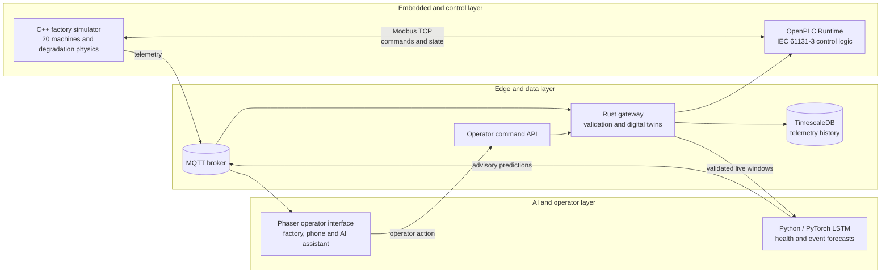
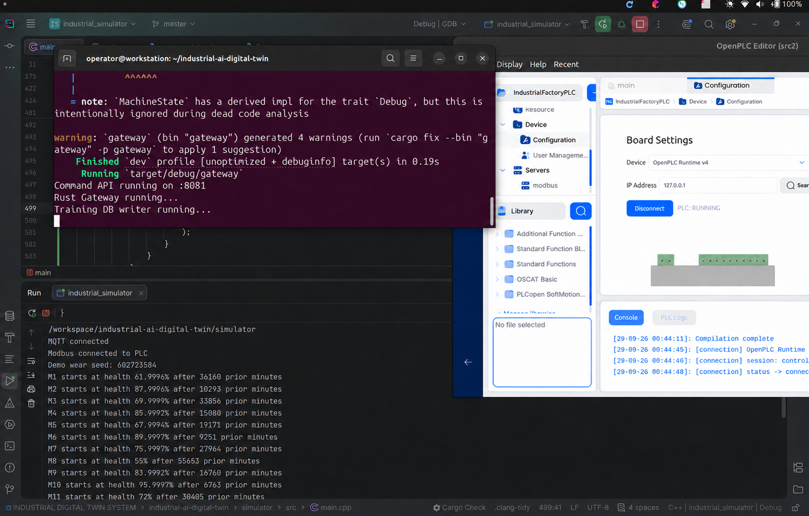
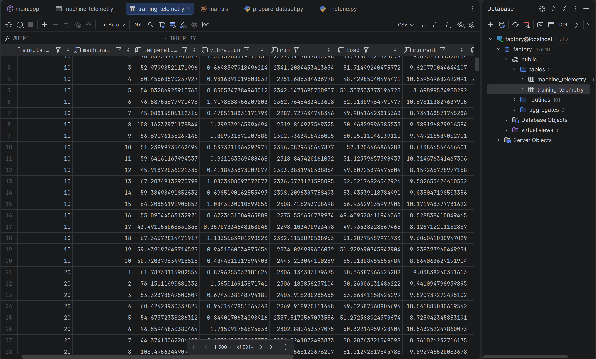
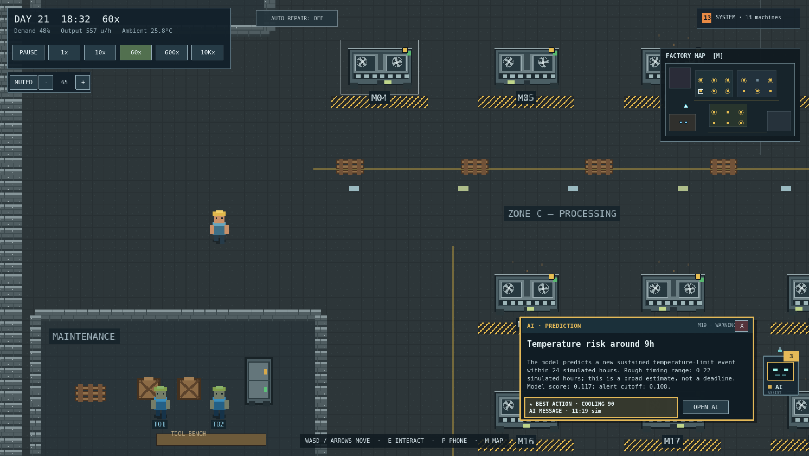
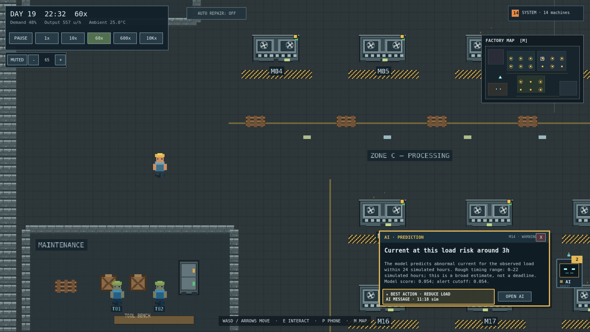
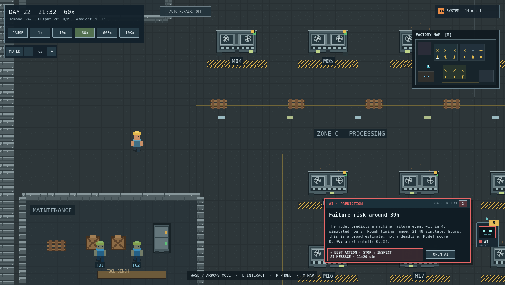
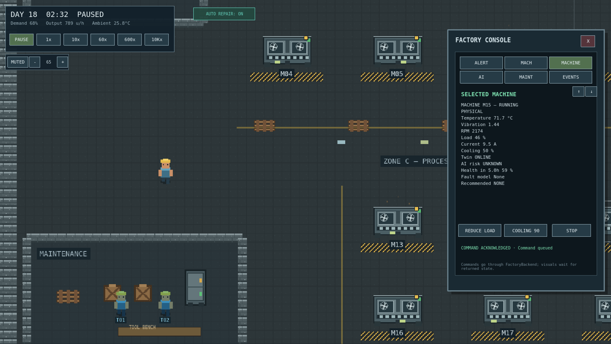
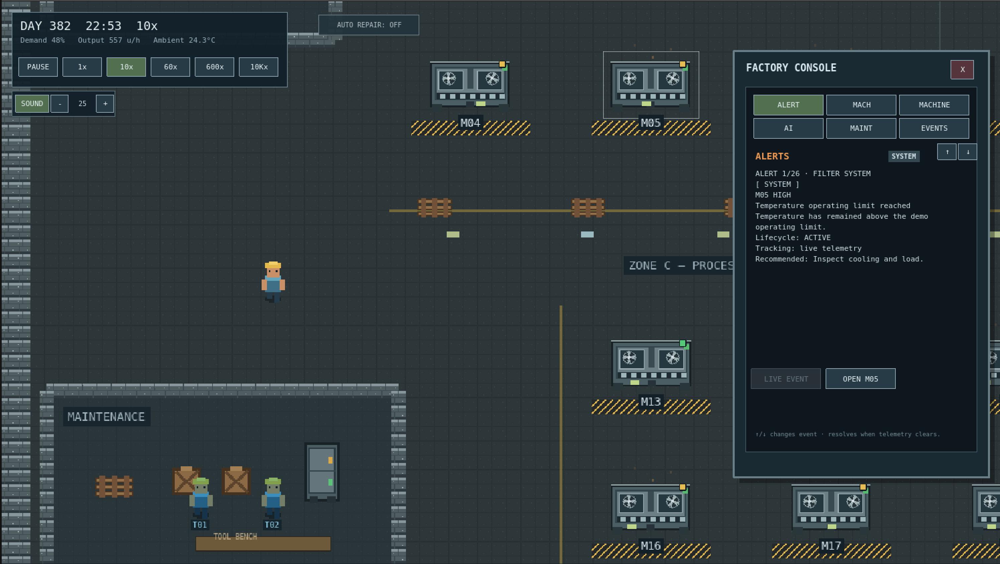

# Industrial AI Digital Twin

An end-to-end predictive-maintenance platform combining industrial control, edge computing, time-series storage, and machine-learning forecasts.

The project models a factory with 20 independently aging machines. A C++ process simulates physical behavior, OpenPLC executes deterministic control logic, a Rust gateway maintains live digital twins, TimescaleDB stores telemetry, and PyTorch models warn operators about sensor-limit events and machine failures before they occur. A Phaser interface turns the complete system into an interactive factory demonstration.

> The simulator is the development and demonstration environment. The main system is the complete pipeline connecting industrial equipment, control software, edge services, historical data, predictive models, and operators.

## Architecture



The architecture deliberately separates two responsibilities:

- **Deterministic control:** OpenPLC and gateway checks handle commands, interlocks, observed failures, and limits that have already been reached.
- **Predictive intelligence:** the AI estimates future health and event risk. It publishes advice but cannot directly command a machine.

## Embedded, PLC, and Edge Layer

The C++ simulator produces temperature, vibration, RPM, load, current, health, operating state, component degradation, failures, and repair lifecycles. Machines begin at different lifecycle ages so their behavior and warnings do not occur simultaneously.

OpenPLC represents the industrial controller. The simulator exchanges machine state and commands with it over Modbus TCP. The Rust gateway validates incoming data, maintains the live digital-twin state, writes training telemetry to TimescaleDB, generates deterministic `SYSTEM` alerts, relays AI input over MQTT, and exposes the operator command API.

| Live embedded/control path | Time-series data path |
| --- | --- |
|  |  |

## Predictive-Maintenance AI

The Python AI uses PyTorch LSTMs. Each sample presented to the temporal model has shape `(batch, 30, 5)`: 30 consecutive ten-minute observations and five input features:

- temperature
- vibration
- RPM
- load
- current

Health and confirmed future events are used only to construct training targets. Sequence construction prevents leakage across machines, repair lifecycles, or operating-load blocks.

The project reuses its C-MAPSS and PRONOSTIA experiments where compatible, then fine-tunes on simulator telemetry. The deployed event model estimates cumulative risk in six-hour bands for:

- sustained temperature-limit events within 24 simulated hours;
- sustained vibration-limit events within 24 simulated hours;
- abnormal current for the observed load within 24 simulated hours;
- rapid health decline over the next 24 simulated hours;
- machine failure within 48 simulated hours.

The interface reports a machine-specific approximate time and a broader timing range. These values communicate uncertainty and are not exact deadlines. The future-health model is separate from the event model.

## Operator Experience

`AI` and `SYSTEM` messages have different meanings. An AI message describes an outcome that has not happened yet. A SYSTEM message reports a condition already observed by deterministic monitoring. Once an event is observed, its earlier AI warning moves into history instead of continuing as a live forecast.

| Temperature-limit forecast | Load-related current forecast | Machine-failure forecast |
| --- | --- | --- |
|  |  |  |





The interface also provides a factory minimap, machine inspection panels, maintenance workflows, speed controls, randomized machine lifecycles, and operator actions such as load reduction, increased cooling, and machine stops. Those actions travel through the backend control path rather than through the AI model.

## Repository Layout

```text
simulator/                  C++ factory and degradation simulation
Openplc/                    PLC program and Modbus configuration
gateway/                    Rust gateway, digital twins and command API
database/                   TimescaleDB container configuration
ai/                         data loaders, training, evaluation and live inference
phaser-frontend/frontend/   Phaser 3 operator interface
docs/                       architecture notes, component designs and screenshots
```

Additional directories contain earlier service prototypes and experiments. The live demonstration follows the architecture shown above.

## Run the Demonstration

Start Mosquitto, TimescaleDB, and OpenPLC first. Then open four terminals at the repository root:

```bash
# Terminal 1 — Rust edge gateway
cargo run --manifest-path gateway/Cargo.toml

# Terminal 2 — C++ factory simulator
./simulator/cmake-build-debug/industrial_simulator

# Terminal 3 — predictive AI service
ai/.venv/bin/python -u ai/live_inference.py

# Terminal 4 — operator interface
cd phaser-frontend/frontend
npm run dev
```

Open [http://localhost:5173](http://localhost:5173). The AI requires 30 consecutive readings from each machine before it can forecast. At `60x`, collecting that history takes about five real minutes; at `1x`, it takes about five real hours.

## Build and Test

```bash
# C++ simulator
cmake -S simulator -B simulator/cmake-build-debug
cmake --build simulator/cmake-build-debug

# Rust gateway
cargo test --manifest-path gateway/Cargo.toml --locked

# AI pipeline
ai/.venv/bin/python -m unittest discover -s ai/tests -v

# Frontend
cd phaser-frontend/frontend
NODE_OPTIONS=--max-old-space-size=512 npm run build
```

Offline event evaluation is available through `ai/evaluate_events.py`. The training procedure, target definitions, metrics, and experiment limitations are documented in [docs/ai_design.md](docs/ai_design.md).

## Current Scope

The repository demonstrates complete integration and evaluates the models on synthetic simulator data. It is not a certified industrial safety system. Deployment in a real factory requires representative historical machine data, asset-specific limits, confirmed fault and maintenance outcomes, independent temporal validation, calibrated alert policies, and an advisory/shadow trial.

For a factory deployment, deterministic PLC and backend protections remain authoritative. AI forecasts supplement operator decisions; they do not replace safety logic.

## Documentation

- [System architecture](docs/architecture.md)
- [Gateway design](docs/gateway_design.md)
- [AI design, experiments, and validation](docs/ai_design.md)
- [Frontend integration](phaser-frontend/frontend/README.md)
